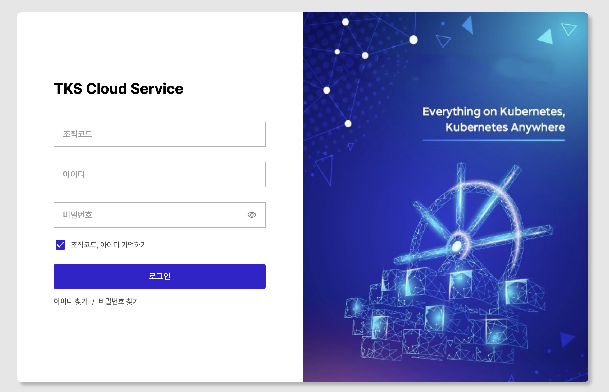
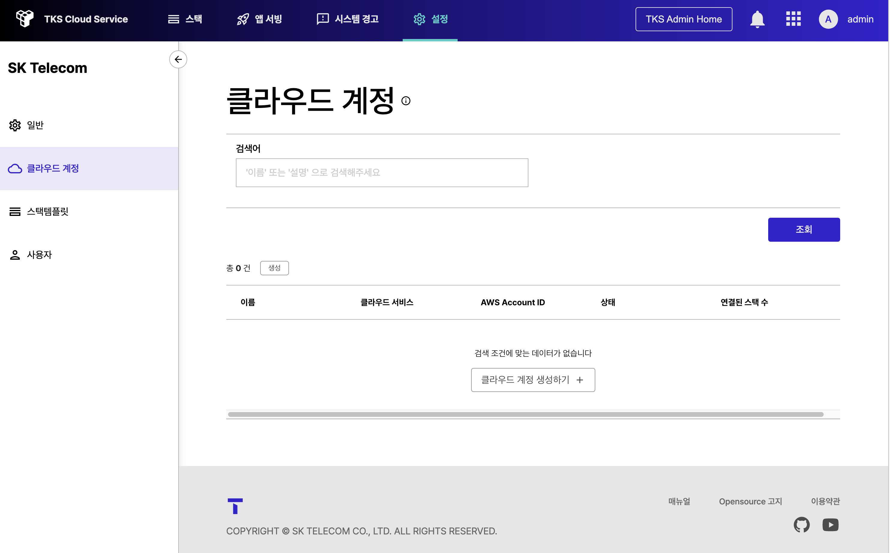
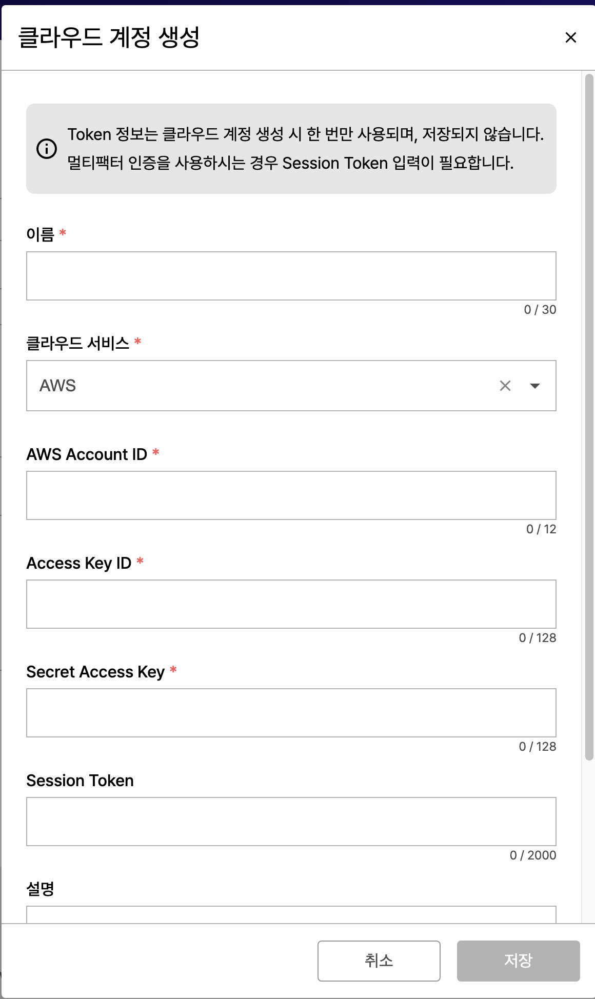
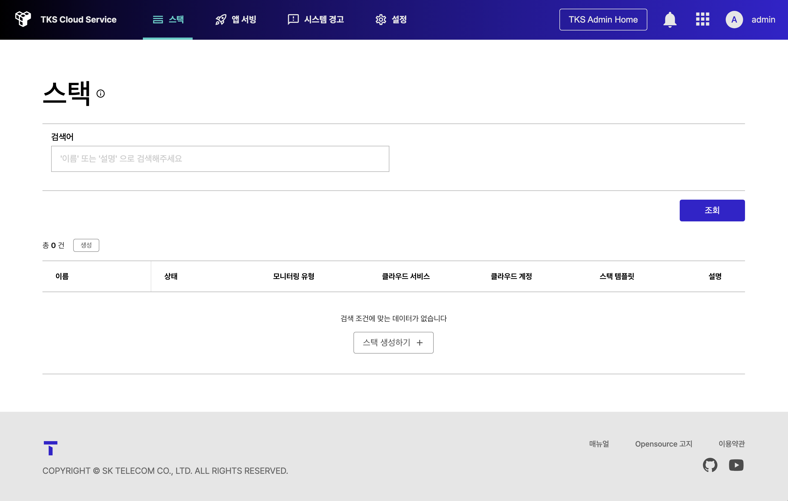
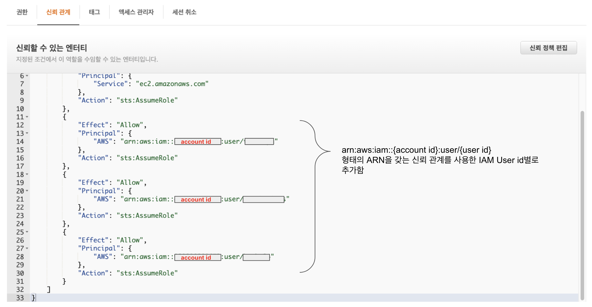
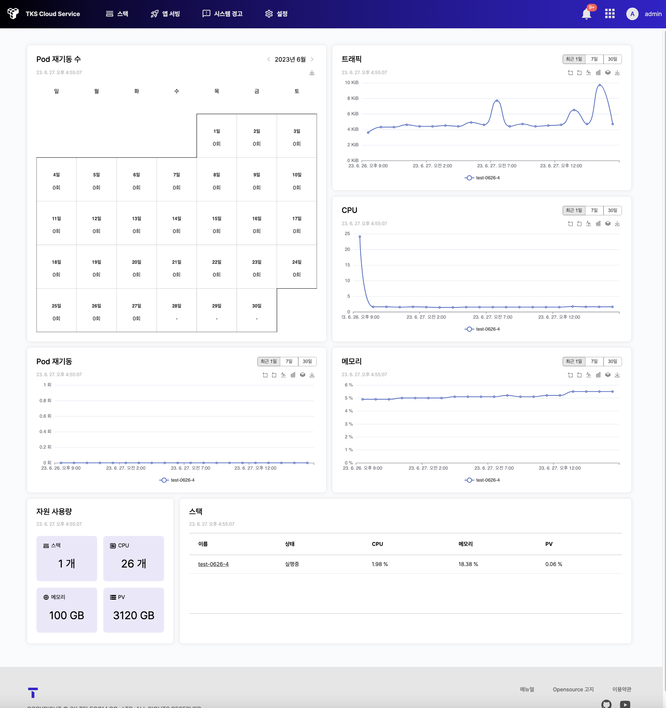
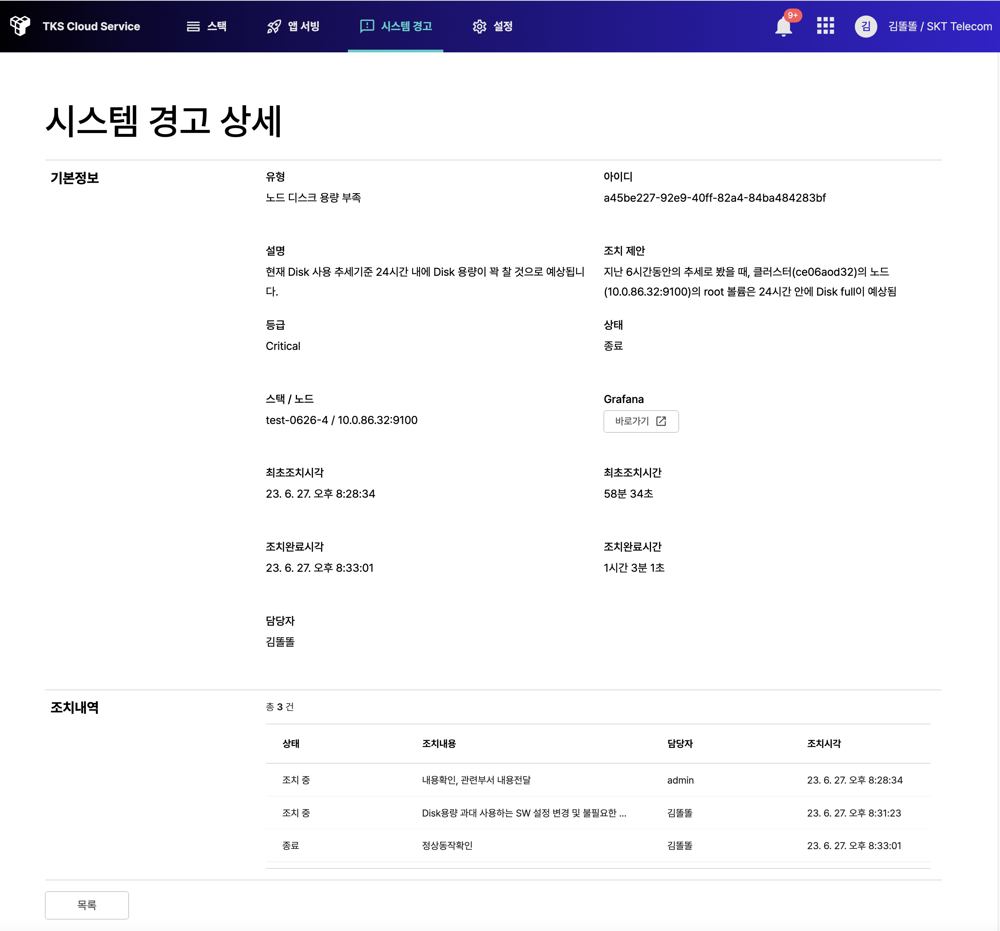

# TKS 자습서
---
## **사전준비** 
본 문서는 TKS를 처음 사용하는 사용자가 혼자서 쉽게 TKS를 익힐 수 있게 하기 위한 문서입니다.

TKS는 Public Cloud에 관리형 K8S와 K8S 기반 응용을 개발/운영하기 위한 도구를 함께 제공하는 All-in-One Container Solution 입니다.
> *본 자습서는 AWS 기준으로 기술되어 있습니다.*

TKS를 사용하기 위해서는 아래와 같은 사전 준비가 필요합니다.

- **TKS 서비스 신청**

     TKS 서비스는 SKT Enterprise 영업에 Off-line 으로 서비스 신청을 해야 서비스 권한을 얻습니다.
     서비스 신청 후, 조직코드와 임시 Admin password를 부여 받게 됩니다.
     > 조직코드: o+8자리 코드로 고객을 구별하기 위한 아이디 입니다
      
   
- **AWS access key ID and secret access key 생성**
  > AWS Acccount 신청은 www.aws.com 에 접속하여 신청 하시거나, SKT Enterprise 영업에 문의 부탁드립니다.

    TKS는 AWS의 자원을 관리하기 위해 AWS Access Key를 사용하여 AWS Assume role 생성 후 사용합니다.
    Secret Access Key는 생성 후, 한번만 노출됨으로 잘 저장하여 관리 해 주십시요.
    자습서는 손쉬은 시작을 위해, 아래와 같이 admin access 권한을 같는 Access Key 를 사용하는 것을 가정 합니다. 
       
    1. **AWS console로 접근 후, IAM User를 생성합니다.**

    2. **생성된 IAM User에 AdminstratorAccess 정책을 부여합니다.**

        
        > 사내 보안 정책에 따라 보다 제한된 정책만 적용 하여 설치 가능합니다. 자세한 가이드는 ==tks-service@sk.com==으로 문의 부탁드립니다.
    
    3. **IAM User의 Access key 를 생성합니다.**

        AWS access key ID / secret access key에 대한 자셍한 정보 및 생성 방법은 아래 AWS 문서를 참고해 주세요.
        https://docs.aws.amazon.com/powershell/latest/userguide/pstools-appendix-sign-up.html
     


---
## **로그인**
   TKS Console (https://tks-console.sktelecom.com)에 접근하면, 아래와 같은 로그인창이 보입니다.
   TKS 서비스 신청 후, 받은 **조직코드** 와 아이디는 **admin** , 비밀번호는 신청 후 받은 **임시비밀번호**을 사용해 주세요.
   > 최초 접속 후, 비밀번로 변경 권고합니다.   
   


---   
## **클라우드계정 생성**
   TKS는 클라우드에 손쉽게 K8S Cluster와 필요한 Tool를 한번에 설치/자동관리해 줍니다.
   TKS는 K8S Cluster + 필요 Tool를 **스택** 이라 부릅니다.
   **스택**을 설치 하기 위해서는 설치할 클라우드를 지정하애 합니다.
   대상 클라우드를 지정하고 대상클라우드를 TKS가 관리하기 위한 Assume Role를 생성하는 과정을 **클라우드계정 생성** 이라고 합니다.

클라우드계정 관리는 상단 매뉴 ==설정== 을 통해 접근가능합니다.
처음 클라우드 계정을 생성하는 경우, 아래 그림과 같이 화면이 표출됩니다.



클라우드 계정 생성하기를 누르면, 아래와 같은 화면이 나옵니다.
사전준비에서 마련해 놓은 AWS 정보를 넣고 저장하면, **클라우드계정**이 생성됩니다.

==TKS는 Access Key를 저장하지 않습니다. AWS Assume Role를 사용하여, 고객의 비밀정보를 저장하지 않고 최소한의 필요 권한으로만 동작합니다.==
> AWS Assume role에 대한 자세한 설명은 아래를 참조 하세요.
> https://docs.aws.amazon.com/IAM/latest/UserGuide/id_roles_use.html

Session Token의 경우 MFA가 적용된 경우 추가로 입력해 하는 값 입니다.

>최근 보안을 위해서 MFA(Multi-Factor Authentication) 사용을 권고합니다. 만약 MFA가 적용된 IAM User가 만든 AWS Access Key를 사용할 경우, Session Token을 추가로 입력해야 합니다. Session Token은 AWS CLI로 생성 할 수 있습니다. 아래 AWS 문서를 참고하십시요.
https://repost.aws/knowledge-center/authenticate-mfa-cli



---
## **스택생성 및 접근**
- **스택생성**

    스택생성을 위해서는 상단매뉴 ==스택== 을 선택하여, 스택관리 화면으로 들어 갑니다.
    

    화면에 ==스택생성하기== 버튼을 통해서 스택 생성 화면으로 이동 합니다. 스택생성 입력창에 필요 정보를 넣습니다.
    앞서 만든 클라우드계정을 선택합니다.
    스택 템플릿은 스택의 종류입니다. 원하는 스택의 종류를 선택합니다.
    > 현재(2023년 7월) 2개의 스택 템플릿의 제공 합니다.
    >    EKS (K8S controlplane)를 사용하며 아래과 같이 2개의 템플릿을 제공합니다.
    >
    >    - EKS Standard(x86) : 기본 구성으로 모니터링 파이프라인 및 필요한 Add-on 이 설치되어 있습니다.
    >
    >    - EKS MSA Standard(x86) : EKS Standard 구성에 Service Mesh를 사용할 수 있는 Tool이 추가 설치되어 있습니다.

    인프라노드는 스택이 제공하는 기본 SW가 구동되는 VM으로 현재 HA 구성(3개 노드 , 3 리전)으로 구성되어 있습니다. 워커노드는 사용자의 응용이 올라가는 노드의 수 입니다. 필요한 정보를 넣은 후 저장 버튼을 누르면 스택이 생성됩니다.
 
    

    저장 버튼을 누르면 아래와 같이, 스택상세 조회 화면으로 이동하며, 설치상태 영역에서 진행 상황을 확인 할 수 있습니다.
    
    스택생성은 비동기로 처리됩니다. 환경에 따라 다르지만 통상 30분 이상 시간이 소요됩니다. 따라서, 상단 매뉴의 ==스택== 으로 이동되면 아래와 같이 스택의 정보를 볼 수 있습니다.
    
    > 테이블을 보면 **모니터링 유형** 항목이 있습니다. TKS는 멀티 스택에 대한 통합 모니터링 환경을 제공 합니다. 최초 생성된 스택의 모니터링 유형은 자동으로 Primary가 됩니다. Primary는 단일 포인트 Access(Grafana)를 제공하는 스택입니다. 이후 생성되는 스택의 모니터링 유형은 Member 입니다.
    >
    > ! Primary 유형의 스택의 Member 유형의 스택을 모두 삭제 전에는 삭제될 수 없습니다.

- **스택접근**

    스택은 2가지 방법으로 접근 가능합니다.

    - **Grafana로 접근**

        하나는 Grafana를 통한 모니터링을 제공 합니다. Grafana는 TKS Console과 SSO를 지원하기 떄문에, TKS Console에 로그인 후 자동 로그인 됩니다. Grafana 접근은 스택 생세 조회 화면의 관리도구 세션에 바로가기 버튼이 있습니다. 다양한 Built-in Dashboard를 제공합니다.
        

     - **kubeconfig로 접근**

         가장 전통적인 방법으로 CLI를 통해 접근하는 방법입니다. (e.g. kubectl get ns)
         스택 생세 조회 화면의 관리도구 영역의 kubeconfig 다운로드 버튼을 통해 kubeconfig 파일을 다운로드 받을 수 있습니다.
         단, 다운받은 Kubeconfig 파일을 활용하기 위해서는 몇 가지 추가 작업이 필요합니다.
         TKS는 AWS를 사용시 AWS STS(Security Token Service)를 사용하여 Kubernetes API에 안전하게 접근합니다.
         Kubernetes는 사용자 관리 기능을 제공하지 않고, 외부 서비스와 연동하게 설계되어 있습니다. 이는 핵심에 집중하여 본질에 충실하기 위한 Open Source의 정신에 입각한 진화 방향입니다.
         따라서, TKS가 제공하는 Kubeconfig을 사용하기 위해서는 **kubectl** tool 설정된 Host PC에 AWS IAM Authenticator를 설치해야 합니다.   
         CLI 접근을 Host PC에 필요한 Tool은 아래와 같습니다.

          - AWS IAM Authenticator (**0.5.9 version 이상**) 

             https://docs.aws.amazon.com/ko_kr/eks/latest/userguide/install-aws-iam-authenticator.html
      
          - kubectl

             https://kubernetes.io/docs/tasks/tools/
     
          - (option) AWS CLI : 설정이 잘 되었는지 확인 시 필요합니다.

             https://docs.aws.amazon.com/cli/latest/userguide/getting-started-install.html 
  
        
        아래는 IAM User 권한은 AWS STS를 사용하여 K8S API를 사용하기 위한 절차다. 

           1. 사용할 IAM User에 아래와 같은 정책을 추가 한다.

            ```
            {
              "Version": "2012-10-17",
              "Statement": [     
                   {
                       "Effect": "Allow",
                       "Action": "sts:AssumeRole",
                       "Resource": "*"
                   }
              ]      
            } 
            ```

           2. TKS를 관리하는 Role에 사용할 IAM User를 신뢰할 수 있있는 Entity로 추가 한다.

             TKS로 스택을 최초 생성 시, ==controllers.cluster-api-provider-aws.sigs.k8s.io== 을 생성 합니다.
             위 Role에 IAM User의 ARN을 신뢰 할 수 있는 개체로 등록합니다.
             IAM > 역활 > 신뢰관계 에서 아래와 같은 내용을 추가 한다.

             

          3. IAM User의 AWS access Key를 생성한다.
          4. Host PC에 AWS 환결 설정
             사용자 루트 Directory 하위 " .aws"에 설정화일을 생성한다.

             config 파일 예

             ```
             [default]
             region = ap-northeast-2
             output = json
             ```

             credential 파일 예

             ```
             [default]
             aws_access_key_id = IAM User에서 생성한 Key ID
             aws_secret_access_key = IAM User에서 생성한 Key 값
             ```

             아래 명령어를 통해, 현재 kubeconfig에서 사용할 IAM User를 확인 할 수 있다.

             ```
             $ aws sts get-caller-identity

             {
                 "UserId": "xxxxxxxxxxxxxxxxxx"
                 "Account": "123412341234",
                 "Arn": "arn:aws:iam::123412341234:user/gildonghong"
             }
             ```


          이제 kubectl를 이용하여 스택을 사용 할 수 있다.
      
---
## **앱서빙생성 및 변경**

---
## **깨끗히 청소 하기**
   TKS는 안전한 자원 삭제를 위해 자원 삭제시 선 조건이 있습니다.
   - 스택의 삭제
     앱서빙을 통해 앱이 설치된 스택은 삭제되지 않습니다. 먼저 앱서빙을 삭제해 주세요.
     모니터링 유형이 Primary인 스택의 경우, 다른 스택이 있으면 삭제되지 않습니다. 모니터링 유형이 Member인 모든 스택을 삭제 후 삭제해 주세요.
   - 클라우드계정 삭제
     크라우드계정을 사용하는 스택이 있는 경우, 삭제 되지 않습니다. 먼저 클라우드계정을 사용하는 모든 스택을 삭제 후 삭제해 주세요.
---
## **TKS 운영하기**
- **대시보드 이해하기**

    TKS는 최종적으로 사용자가 앱현대화를 통해 서비스를 유연하고 효율적으로 운영하는 것을 목적으로 한다.
    따라서 TKS의 대시보드는 단순히 Infra에 대한 상태가 아닌, Infra에서 동작하는 응용에 대한 정보를 단순화 시켜서 제공하고자 하는 목표을 가지고 있다.
    아래는 TKS의 대시보드다.
    

    대시보드는 크게 3개의 컨셥을 가지고 화면을 분활하여 정보를 표출한다.
    - **서비스 안전성 : 상단 우측**
      서비스의 안전성은 **Pod 재기동** 수에 의해 추상화 될 수 있다. 파드가 재 기동되는 경우는 다양하지만 크게 보면 1) 자원의 부족에 의한 파드 재배치 2)오류에 의한 기동 실패 로 나눠지고 된다. 자원 부족의 경우 IaaS 자원의 부족인 경우도 있지만, Pod Spec의 오류에 의한 문제의 경우도 종종 발생한다. 그 외 Pod에 설치되는 SW 오류에 의해, 특정 Event나 특정 수 이상의 서비스 Session 발생 시 Pod 재기동이 발생한다. 따라서 Pod 재기동는 SW의 안정성과 Pod 설정 오류등 워크로드의 안전성에 대한 지표를 제공 한다.
    - **서비스 자원 특성: 상단 좌측**
      서비스의 증가는 유입 Traffic의 증가로 추상화 될 수 있다.
      따라서 유입 Traffic의 증가와 같이 자원 사용량 (CPU/Memory) 추세 확인을 통해, 앞으로 증/감설 계획을 세울 수 있다.
      이를 통해 비용 효율적으로 자원을 활용 할 수 있는 데이터를 제공한다.
    - **자원 현황: 하단**
      생성된 스택의 수와 사용된 자원의 개수를 한번에 볼 수 있게 정리해 준다. 이를 통해 IaaS 비용을 산정할 수 있다.

- **시스템경고 이해하기**

     TKS의 단순 히, 시스템 경고의 전파가 아니라, 문제에 대한 해결 방안과 문제 해결 History관리 기능을 제공하여 운영을 지속하면 시스템경고가 발생하는 빈도를 줄여, 궁극적으로 사용자의 서비스 운영 역량을 높이는 것 입니다.
     아래는 시스템경고의 자세한 화면의 예 입니다.
     
      TKS의 시스템 경고는 경고에 대한 설명 뿐 아니라, 발생한 위치 및 조치 제안을 같이 제공합니다.
      또한 시스템경고 발생 부터 최초 인지 및 해결까지의 시간을 관리함으로 상용자 스스로 장애대응 역량을 수치화하여 관리 할 수 있습니다.
      특히, 조치내역에 대한 히스토리가 시간순서대로 관리 함으로, 사용자의 운영 노하루를 데이타화 하여 관리 할 수 있습니다.

- **일반설정 및 사용자 관리**

    TKS는 일발설정 기능을 통해, TKS의 사용자들간에 공유되야 할 정보 (e.g 연락처)를 간단하게 공유 할 수 있습니다.
    또한 자체적으로 2가지 종류의 사용자를 제공합니다. (관리자/사용자)
    관라자 권한는 TKS의 모든 권한을 갖는 사용자 입니다.
    사용자 권한은 스택과 같은 인프라의 생성 및 설정 및 시스템경고 처리는 불가능 하지만, 스택의 사용 및 앱서빙의 사용은 가능합니다. 사용자 권한은 부서별 혹은 회사별 협력 개발 시, 유용한 권한 입니다.


